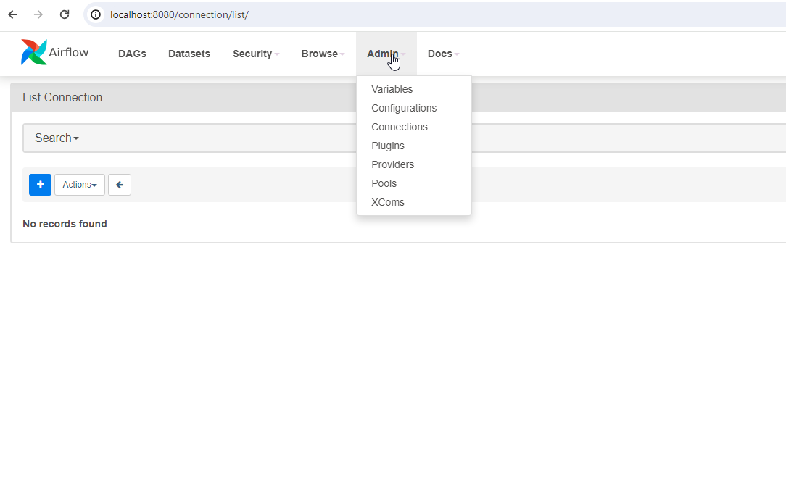
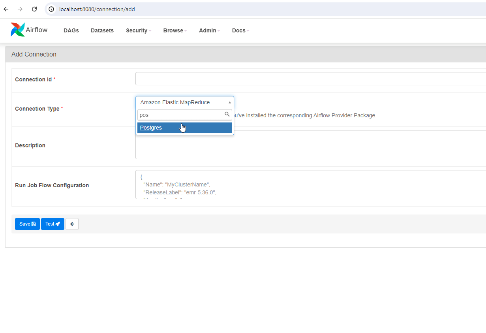
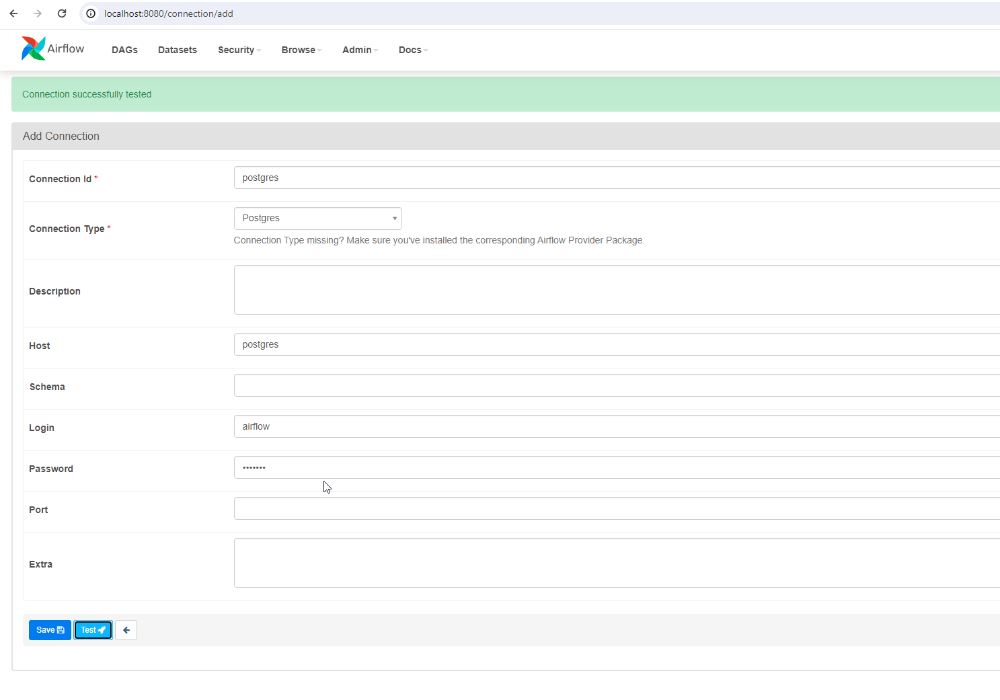
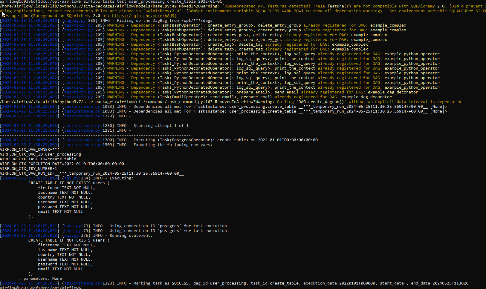

# Create a Table in Postgres Database

## Learning Objective:

By completing this coding exercise, you will be able to:
- Create tasks in your Airflow DAGs
- Run SQL queries on Postgres
- Use connections in your tasks to interact with third-party tools

## Instructions:

Within your existing DAG user_processing, add your first task to run a SQL query on Postgres that:

- Has the name create_table
- Uses the connection "postgres" you've created in the Airflow UI
- Update the task with SQL Query and run it.

## Steps

### Step 1: Add the Connection in the Airflow UI



### Step 2: Add the Connection as 'postgres' with the following details:

- Connection Id: postgres
- Connection Type: Postgres
- Host: postgres
- Login: airflow
- Password: airflow
- Port: 5432

Test the Connection and Save.






### Step 3: Verify the Postgres Connection

- Go to DBEaver or any other SQL client and verify the Postgres Connection.
- Observe the databases and tables in the Postgres Database.

If you Get any error, please check the connection details and try again.


### Step 4: Add the PostgresOperator to the DAG

- Import the PostgresOperator
- Add the PostgresOperator task to the DAG
- Use the connection "postgres"


```python
from airflow import DAG
from datetime import datetime
 
from airflow.providers.postgres.operators.postgres import PostgresOperator
 
with DAG(
    dag_id="user_processing",
    start_date=datetime(2023, 1, 1),
    schedule_interval="@daily",
    catchup=False
) as dag:
    
    create_table = PostgresOperator(
        task_id='create_table',
        postgres_conn_id='postgres',
        sql='''
            CREATE TABLE IF NOT EXISTS users (
                firstname TEXT NOT NULL,
                lastname TEXT NOT NULL,
                country TEXT NOT NULL,
                username TEXT NOT NULL,
                password TEXT NOT NULL,
                email TEXT NOT NULL
            );
        ''')
```

### Step 5: Validate the DAG

Login to the airflow secheduler and check the DAG user_processing.
In your case if the container name is different, please replace it with your container name.

```bash
docker exec -it airflow-tutorials-airflow-scheduler-1 /bin/bash
```

```bash
airflow tasks test user_processing create_table 2022-01-01
```
You Should see the task is successful.



